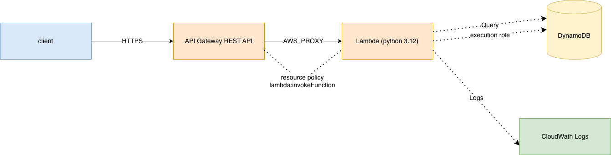

# IoT Readings API — Terraform Build

Serverless CRUD API for device sensor readings, defined entirely in Terraform.

## Problem

An IoT fleet needs to post temperature and humidity readings and query them back per device, in time order, without running any servers. 

## Architecture



`Client → API Gateway (REST) → Lambda (Python 3.12) → DynamoDB`

Table `iot-tracker-<env>`: `device_id` (partition key), `recorded_at` (sort key)

## Key Tradeoffs

- **Why DynamoDB over RDS:** single-digit-ms key lookups, no server management, idles at $0. Access patterns must be known up front.
- **Why Lambda over ECS:** bursty, low-duty-cycle traffic.
- **Why REST API over HTTP API:** request validation and usage plans available when needed; HTTP API is ~70% cheaper and would be the production pick on cost alone.
- **Why `recorded_at` not `timestamp`:** `timestamp` is a DynamoDB reserved word and would need `ExpressionAttributeNames` aliasing on every query.
- **Why Terraform over CLI:** resource references replace manually captured IDs, the dependency graph replaces hand-ordered teardown, and applies are idempotent. Built the same architecture with the CLI first `(crud-cli)` to see the difference.

## Cost

- **Dev/test:** ~$0 (Free Tier + $1 budget alarm)
- **At scale:** API Gateway REST bills first — ~$3.50/million requests, no permanent free tier. Lambda's 1M requests/month free tier is permanent; DynamoDB on-demand is negligible at low volume.

## Build Process

CLI build first (understand each resource), then Terraform (declarative, repeatable). `terraform destroy` after each session.

Terraform is split into reusable modules and per-environment roots:

```
modules/          envs/
  dynamodb/         dev/
  iam/              prod/
  lambda/
  api/
```

- **`dynamodb`** — the readings table. Key schema is hardcoded because the handler depends on it; only the name and the destroy guardrails vary.
- **`iam`** — the Lambda execution role and its DynamoDB policy. Deliberately *not* inside the lambda module: a function and the permissions it needs change for different reasons, so the lambda module takes a `role_arn` and creates no IAM of its own.
- **`lambda`** — the function, its zip packaging and its log group.
- **`api`** — the whole REST API: resources, methods, integrations, deployment, stage, and the `lambda_permission` that lets API Gateway invoke the function.

Each `envs/*/main.tf` is nothing but module blocks wired together — `dynamodb` → `iam` → `lambda` → `api`, dependencies expressed through output references rather than `depends_on`. Resource names are composed in the environment root from a `name_prefix` local and passed down complete; modules never interpolate the environment themselves. `dev` and `prod` call the same modules and differ only in guardrails: log retention, deletion protection, API throttling and reserved concurrency.

CI runs format, validate and lint only — no credentials, no state, no cost. `plan` and `apply` are written out in full but commented, because neither can work against local state; they unlock once the S3 backend and a GitHub OIDC role exist.

## At Production Scale

Real production isolation is a **separate AWS account** with its own credentials, its own state backend and its own blast radius. `envs/dev` and `envs/prod` here share one account and one set of credentials — what they demonstrate is the code-level pattern (separate state, separate names, environment-specific guardrails), not genuine isolation. The step up is AWS Organizations with an account per environment and cross-account OIDC roles; nothing in this layout has to change to get there except the backend and provider configuration in each `envs/*` root.

## Tested / Monitored

- **Verified:** all five CRUD operations end-to-end via curl. See [test-cases.md](test-cases.md)
- **Not covered:** load testing, malformed JSON, pagination past DynamoDB's 1MB Query limit, authentication.
- **Monitoring:** CloudWatch Logs, 7-day retention in dev and 30 in prod. Not implemented: alarms, custom metrics.

## Stack

`API Gateway` `Lambda` `DynamoDB` `IAM` `CloudWatch` `Terraform` `Python`